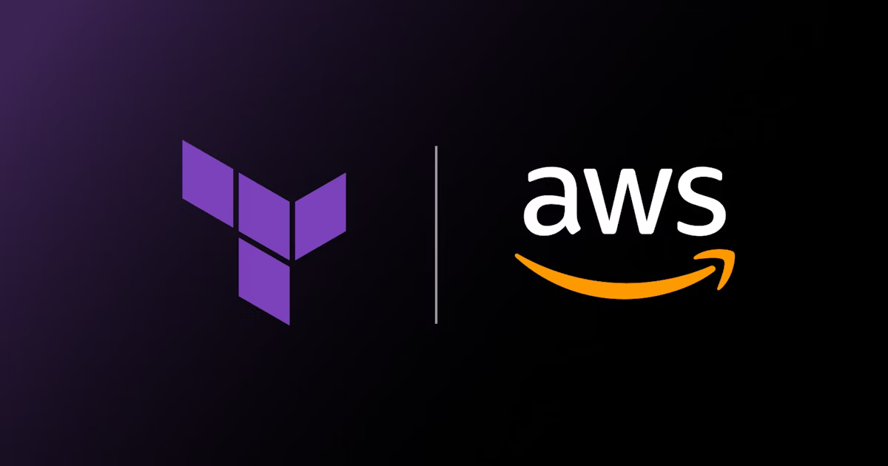

# AWS EC2 Nginx Docker Automation



This project automates the provisioning of AWS infrastructure using Terraform. It sets up a custom Virtual Private Cloud (VPC), a public subnet, an Internet Gateway, a Route Table, a Security Group, and an EC2 instance. On the EC2 instance, a Docker container running Nginx is deployed, serving a static HTML page accessible via a web browser.

## 🛠️ Infrastructure Overview

The following AWS resources are provisioned:

- **Custom VPC**: Isolates the network environment.
- **Public Subnet**: Hosts the EC2 instance with public IP accessibility.
- **Internet Gateway**: Enables internet access for the VPC.
- **Route Table**: Directs traffic from the subnet to the Internet Gateway.
- **Security Group**: Controls inbound and outbound traffic:
  - Inbound: Allows SSH (port 22) and HTTP (port 80) from any IP.
  - Outbound: Allows all traffic for installations and Docker image fetching.
- **EC2 Instance**: Runs Amazon Linux 2 AMI with Docker installed.
- **Nginx Docker Container**: Serves a static HTML page.

## 📁 Project Structure

```bash
├── main.tf # Terraform configuration for resources 
├── variables.tf # Input variables for customization 
├── outputs.tf # Outputs like EC2 public IP 
├── user_data.sh # Script to install Docker and run Nginx container 
└── README.md # Project documentation
```


## ⚙️ Prerequisites

Ensure you have the following:

- [Terraform](https://www.terraform.io/downloads.html) installed.
- An active [AWS account](https://aws.amazon.com/).
- AWS credentials configured (either via AWS CLI or environment variables).

## 📝 Setup Instructions

1) Clone this repository:

```bash
git clone https://github.com/yourusername/aws-ec2-nginx-docker.git
cd aws-ec2-nginx-docker
```
2) Initialize Terraform:
```terraform
terraform init
```

3) Review the execution plan:

```
terraform plan
```

4) Apply the configuration to provision the infrastructure:
```
terraform apply

OR 

terraform apply --auto-approve 
```
Confirm with yes when prompted.

5) After deployment, Terraform will output the public IP of the EC2 instance. Access the Nginx server by navigating to http://<EC2_PUBLIC_IP> in your web browser.

## 🔧 Customization

You can customize the following variables in variables.tf:

    region: AWS region for resource deployment.

    instance_type: EC2 instance type (e.g., t2.micro).

    ami_id: Amazon Machine Image ID for the EC2 instance.

    vpc_cidr: CIDR block for the VPC (e.g., 10.0.0.0/16).

    subnet_cidr: CIDR block for the subnet (e.g., 10.0.1.0/24).

🧹 Cleanup

To destroy the provisioned resources:
```terraform
terraform destroy
```
Confirm with yes when prompted.